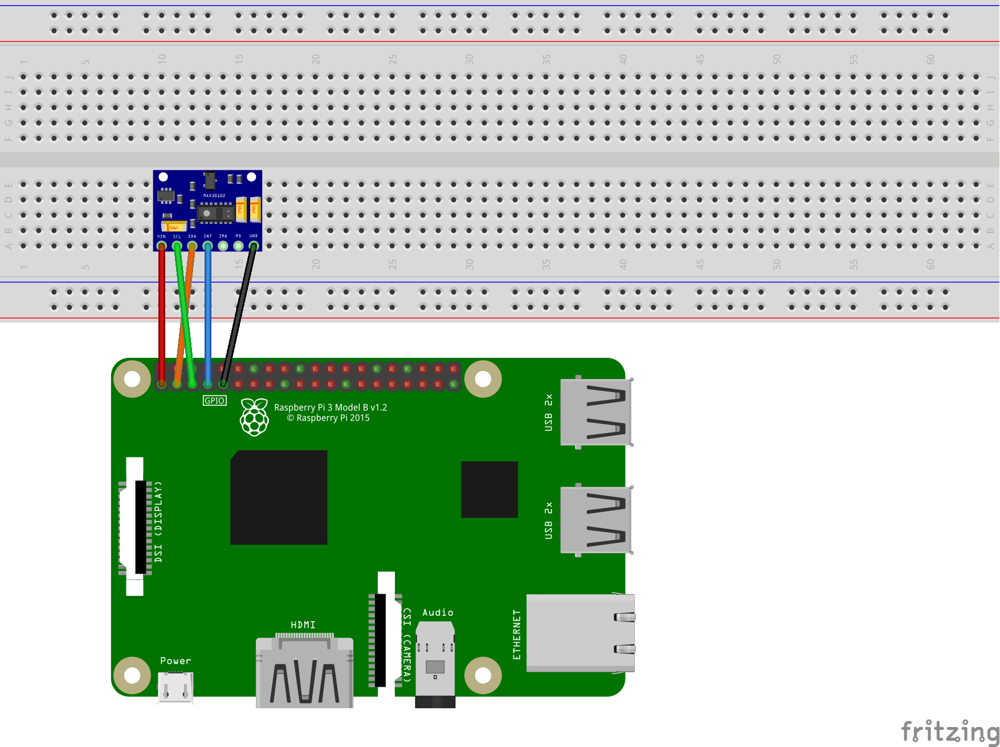
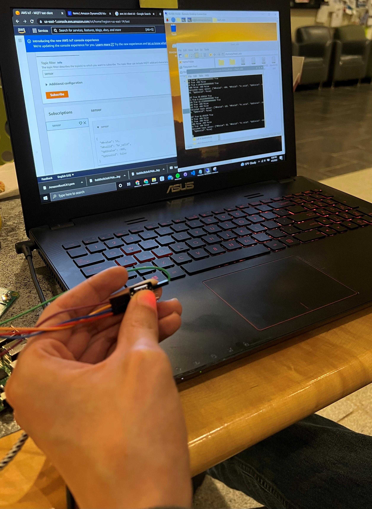
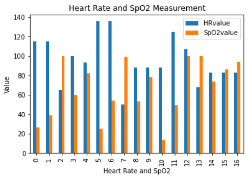

# RPi-heartrate

## Description
The goal of this project is to gather heart rate and SpO2 data using the Raspberry Pi and Max30102 sensor. The data will simultaneously be sent to AWS and stored using DynamoDB. Lastly, the data will be extracted and analyzed using Jupyter Notebook and Python pandas. 

---

## Required Hardware
* Raspberry Pi with Python v.2.7+
* Max30102 sensor

---

## Design
* Pin 1 to Vin
* Pin 3 to SDA
* Pin 5 to SCL
* Pin 7 to INT
* Pin 9 to GND

---

## Setup

---

Results

